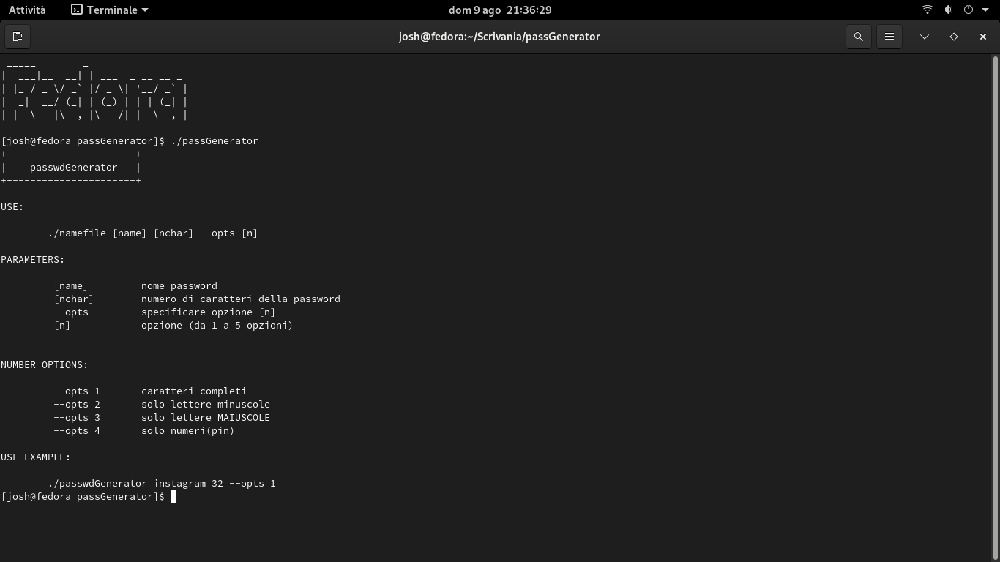

**{ PasswdGenerator }**

tool programmato in C con licenza gplv3,è in grado di generare una password pseudocasuale facendo uso di diversi parametri;alla prima esecuzione verra creato un file chiamato filePass.txt in cui saranno contenuti tutti i futuri nomi e le corrispettive password associate.

**1)compiled Linux:**

```shell
./make.sh
```

**2)compiled Winzzoz:** 

*32bit*

```batch
gcc -m32 mainPasswd.c passwdFunc.c -o passwdGenerator 
```

*64 bit*

```batch
gcc mainPasswd.c passwdFunc.c -o passwdGenerator 
```

**================================**

**instruction linux**

```shell
./passwdGenerator
```

or

```shell
./passwdGenerator --h
```

or

```shell
./passwdGenerator help
```

or

```shell
./passwdGenerator --help
```

or

```shell
./passwdGenerator -h
```

*output linux:*

```bash
+----------------------+
|    passwdGenerator   |
+----------------------+

USE:

    ./namefile [name] [nchar] --opts [n]

PARAMETERS:

     [name]        nome password
     [nchar]       numero di caratteri della password
     --opts        specificare opzione [n]
     [n]           opzione (da 1 a 5 opzioni)


NUMBER OPTIONS:

     --opts 1    caratteri completi
     --opts 2    solo lettere minuscole
     --opts 3    solo lettere MAIUSCOLE
     --opts 4    solo numeri(pin)

USE EXAMPLE:

    ./passwdGenerator instagram 32 --opts 1 
```

*output windows:*

```batch
+----------------------+
|    passwdGenerator   |
+----------------------+

USE:

    namefile.exe [name] [nchar] --opts [n]

PARAMETERS:

     [name]       nome password
     [nchar]      numero di caratteri della password
     --opts       specificare opzione [n]
     [n]          opzione (da 1 a 5 opzioni)


NUMBER OPTIONS:

     --opts 1    caratteri completi
     --opts 2    solo lettere minuscole
     --opts 3    solo lettere MAIUSCOLE
     --opts 4    solo numeri(pin)

USE EXAMPLE:

    passwdGenerator.exe instagram 32 --opts 1
```

<mark>*PHOTO*</mark>

<div>
    
</div>

    
